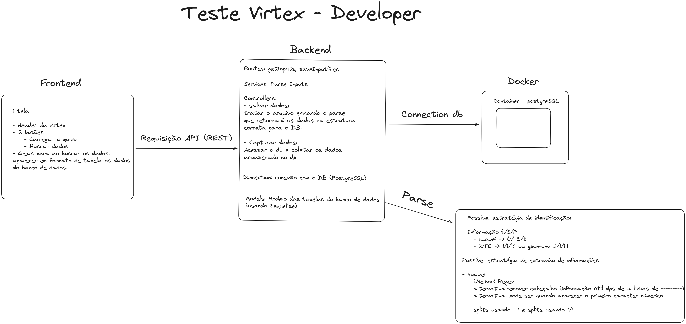

## Pré-requisitos

Para rodar esse projeto, é esperado que você tenha instalado em sua máquina:

- Docker
- Docker-compose
- Nodejs (estou usando a versão v12.22.9)
- npm (estou usando a versão 10.7.0)
- Clone o projeto para a sua máquina
## Iniciando o banco de dados no container Docker


> [!NOTE] OBS
> Como já havia o postgres na minha máquina, a conexão com o container está partindo da port 5433 local para 5432 do container. Caso for visualizar os dados no seu computador, use essa porta. dados de usuário e senha estão disponíveis no .env

Nessa etapa, devemos criar o container e banco de dados. As vezes, por questões de container anteriores e persistência de dados, ele pode não criar. você pode criar vc mesmo o bd 'virtex' no postgres ou executar o comando 

```
docker-compose down -v
```

Agora sim pode subir o container. Dentro do diretório principal (./developer-test), você encontrará um arquivo chamado  docker-compose.yml. Para iniciar nosso container com o Postgres, basta executar o comando:  

```bash
docker-compose up -d 
```

É esperado um container com o postgres e um banco de dados chamado virtex.

O próximo passo é inicializar nosso backend e nosso frontend.

## Backend

> [!NOTE] OBS2 
> Note que eu usei o .env tanto no frontend, quanto no backend. Para facilitar a implementação, eu já subi esses arquivos no repositório também, o que pode não ser uma boa prática em contextos reais.

> [!NOTE] OBS3
> Serão necessários 2 terminais para rodar o front e back simultaneamente.

No diretório /backend execute o seguinte comando:

```bash
npm install
```

Ele instalará todas as dependências do projeto. 

Após isso, nós precisamos finalizar nosso banco de dados. Para criar as tabela, execute as migrações do sequelize com o comando

```bash
npx sequelize-cli db:migrate
```

Após inicializar o postgres rodando no container e as migrations realizadas, é esperado que você tenha um banco de dados no container chamado virtex com as tabelas necessárias para o problema. Nosso banco está Ok :).

Após isso, nosso backend está pronto pra ficar online. Ele está sendo executado localmente na porta 3001. Caso essa porta já esteja sendo utilizada, vá no arquivo .env do backend e troque a porta. Será necessário também, caso haja troca, que você faça essa troca também no .env do frontend, pois deixei as requisições com localhost e a porta 3001.

Agora sim, em um terminal, execute o comando 

```
npm run dev
```

É esperado que seu backend esteja rodando corretamente.

## Frontend

Para rodar, o frontend, em outro terminal vá na pasta frontend/virtex-test/ e execute o comando

```bash
npm install
```

Ele instalará todas as dependências do projeto. 

Após isso, se a porta no .env estiver de acordo com a porta que o backend está rodando, basta executar o comando

```bash
npm run start
```

Nosso frontend deve executar no seu navegador e você pode realizar os teste agora. 

Infelizmente, não consegui implementar a tempo um popup para visualizar os status, mas você pode acompanhar pelo console do navegador.

:)

# Funcionamento idealizado do projeto



Aqui você encotra o protótipo no [Figma](https://www.figma.com/design/BLJx92veEpUejngVxx2nUs/dev-test-virtex?node-id=0-1&t=eplg9dDQuGVwS6sA-1)


Ao criar o projeto, após várias leituras do pdf do case, eu deduzi um comportamento esperado do usuário para com o sistema. Alguns comportamentos não eram exatamente bem detalhados (até pq esse não era o objetivo do teste), então tive que escolher algumas estratégias de funcionamento, o que pode não estar de acordo com o esperado (em casos reais, eu teria perguntado para alguém kkkkkk)

Seguindo as etapas partindo do usuário, o sistema está funcionando da seguinte forma:

1. O usuário escolhe um arquivo .txt 
2. O arquivo é enviado e avaliado por um middleware que decide por meio de regex se aquele arquivo se enquadra no padrão de dados de um dos 3 inputs (o regex leva em consideração a parte dos dados)
3. caso não, bad request
4. Caso sim, o middleware já adiciona na requisição que tipo de arquivo é e de qual marca (zte ou huawei). O arquivo é enviado para o cotroller.
5. No controller, o arquivo é recebido (pelo multer) e salvo em /uploads. Depois, ele é enviado para as função parse com o respectivo regex.
6. A função parse abre o arquivo e por meio do regex enviado, extrai as informações, quando as informações são encontradas.
7. Após processado os dados, é enviado para a querie que insere no banco. Essa etapa foi feita levando em consideração as duas marcas:
	1. Para ambos os casos, eu me preocupei em criar os dados, mas se para aquele registro, ele já estivesse criado, apenas atualizar os dados (como o status, por exemplo)
	2. huawei: como era só um arquivo, facilmente eu teria todas as informações, então bastava inserir. Usava o ON CONFLIT com a chave unica sn para identificar o conflito e atualizar os dados.
	3. zte: Nesse caso, como o usuário só envia um por vez, caso ele enviasse 1 arquivo, eu teria slot, port, ont_id e state e no outro slot, port, ont_id, sn. Eu não poderia usar o ON CONFLIT aqui da forma que estava, pois o usuário poderia inserir o primeiro .txt que não tivesse o sn. também imaginei que o slots, port e onto_id não poderia ser únicos por si só. Portando, a estratégia aqui foi criar um index unico que ligava slot, port, ont_id e brand(que é a marca). Assim, se eu encontrasse um conflito para um registro, eu poderia garantir que era o slot, port, ont_id da marca zte. 
8. Após inseridos os dados, é retornado o sucesso.
9. Ao capturar os dados, é feito apenas um GET no banco todo para capturar ar informações relevantes para a tabela no frontend.

# Faltou, mas era pra ter kkkk
- testes
- popup de status no frontend (arquivo enviado, erro)
